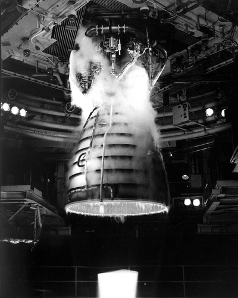

# colormap




## References

The color maps ```inferno```, ```masma```, ```plasma```, ```viridis``` were created by Stéfan van der Walt ([@stefanv](https://github.com/stefanv)) and Nathaniel Smith ([@njsmith](https://github.com/njsmith)). More information is available [here](https://bids.github.io/colormap/) and palette data can be found at [BIDS/colormap](https://github.com/BIDS/colormap).

The color maps ```crest```, ```flare```, ```icefire```, ```mako```, ```rocket```, and ```vlag``` were created for the Python statistical data visualization package [```Seaborn```](https://github.com/mwaskom/seaborn). More info on ```Seaborn``` color palettes can be found at their [website](https://seaborn.pydata.org/tutorial/color_palettes.html).

The color map ```cividis``` was developed by Jamie R. Nuñez, Christopher R. Anderton, and Ryan S. Renslow. More info can be found in their [paper](https://journals.plos.org/plosone/article?id=10.1371/journal.pone.0199239).

The color map ```turbo``` was developed by Anton Mikhailov ([@antonthefirst](https://github.com/antonthefirst)). More info can be found at the [Google AI Blog](https://ai.googleblog.com/2019/08/turbo-improved-rainbow-colormap-for.html).

Image above courtesy of NASA.
